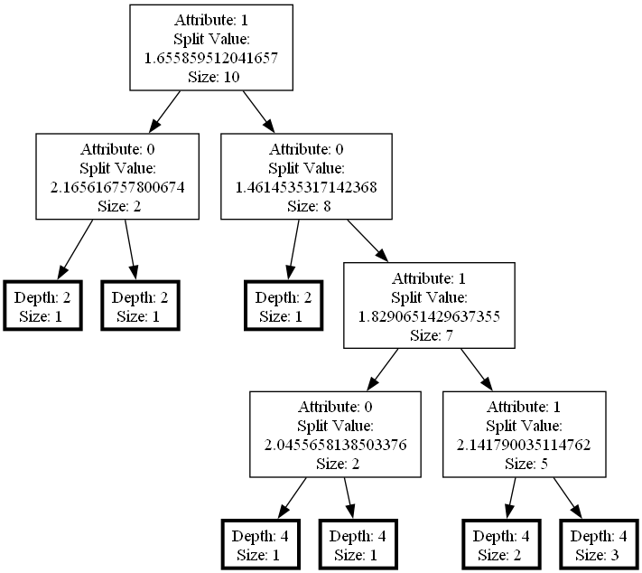

# isolation-forest-visualization

## Overview

**`isolation-forest-visualization`** is a tool for anomaly detection based on the Isolation Forest algorithms. It provides functionality for creating isolation forest, evaluating anomalies, and **visualizing** the trees in the forest.

## Installation

Before installing and using the library, make sure you have installed [Node.js](https://nodejs.org/en/download) and [Graphviz](https://graphviz.org/download/) properly, based on your operating system.

Installation of the _npm_ package:
```bash
npm install isolation-forest-visualization
```

## Usage

### Creating an Instance of IsolationForest Class

To create an instance of the `IsolationForest` class, follow these steps:

1. Import the required module:

```javascript
const { IsolationForest } = require('isolation-forest-visualization');
```

2. Instantiate the `IsolationForest` class with the desired parameters:

```javascript
const data = [[7, 3], [2, 5], [3, 4]]; // data to analyze
const numberOfTrees = 100; // number of trees in the forest
const sampleSize = 256; // sample size

const myForest = new IsolationForest(data, numberOfTrees, sampleSize);
```
**Note:** the data should be array of arrays, all data members (inner arrays) must be of the same length and must be unique. 

### Methods

#### `dataPathLength()`

Calculate the average path length for each data member over all isolation trees (returns an array). In the example below they saved into a variable `averagePathLengths`.

```javascript
const averagePathLengths = myForest.dataPathLength();
```


#### `dataAnomalyScore()`

Calculate the anomaly score for each data member (returns an array). In the example below they are saved into a variable `anomalyScores`.

```javascript
const anomalyScores = myForest.dataAnomalyScore();
```


#### `dataAnomalyScore(numberOfAnomalies)`

##### (using optional parameter to display top anomalies)

Calculate the anomaly score for each data member (returns an array). If `numberOfAnomalies` is provided, it also prints information about the top anomalies. 

```javascript
const numberOfAnomalies = 5; // number of anomalies to display
const anomalyScores = myForest.dataAnomalyScore(numberOfAnomalies);
myForest.dataAnomalyScore(numberOfAnomalies); // just print info 
```


#### `exportTree(treeToExport, exportFormat, fileName, exportInfo)`

Export a single tree from the forest as an image file. In the `IsolationForest` class trees are stored in an array called `forest`, and can be accessed based on their index.

```javascript
const treeToExport = myForest.forest[0];   // tree to export
const exportFormat = 'png'; // output format (e.g., png, svg, pdf)
const fileName = 'tree'; // output file name (without extension)
myForest.exportTree(treeToExport, exportFormat, fileName);
```
**Note:** export format and file name are strings, file name can be provided including a name of an existing folder (`"img/tree"`). Export format can be a supported format of the Graphviz software (e.g. `png, pdf, dot, jpg, svg`).


#### `exportForest(forestExportFormat, fileName)`

Export the entire forest as image files, one for each tree. The rules for export format and file name are the same as for `exportTree` method. The name of the exported file will include the index of the tree from the `forest` array (e.g. `"forestExport0.png"`).

```javascript
const forestExportFormat = 'png'; // output format (e.g., png, svg, pdf)
const fileName = 'forestExport'; // output file name (without extension, index will be appended)
myForest.exportForest(forestExportFormat, fileName);
```


## Example

An example of how to use the `isolation-forest-visualization` library:

```javascript
const { IsolationForest } = require('isolation-forest-visualization');

// Sample data
const data = [[1, 2], [3, 4], [5, 6], [7, 8]];

// create an Isolation Forest instance with 5 trees and sample 2
const myForest = new IsolationForest(data, 5, 2);

// calculate average path lengths all data
const pathLengths = myForest.dataPathLength;

// calculate anomaly scores for all data, show 2 top anomalies in the console
const anomalyScores = myForest.dataAnomalyScore(2);

// export the tree on index 0
myForest.exportTree(myForest.forest[0], 'png', 'tree');

// export the forest
myForest.exportForest('png', 'forestExport');
```

This example creates an Isolation Forest with sample data, calculates average path lengths and anomaly scores for all data, displays top 2 anomalies in the console, exports the tree on index 0 and then the entire forest as image files.

## Example of exported image

